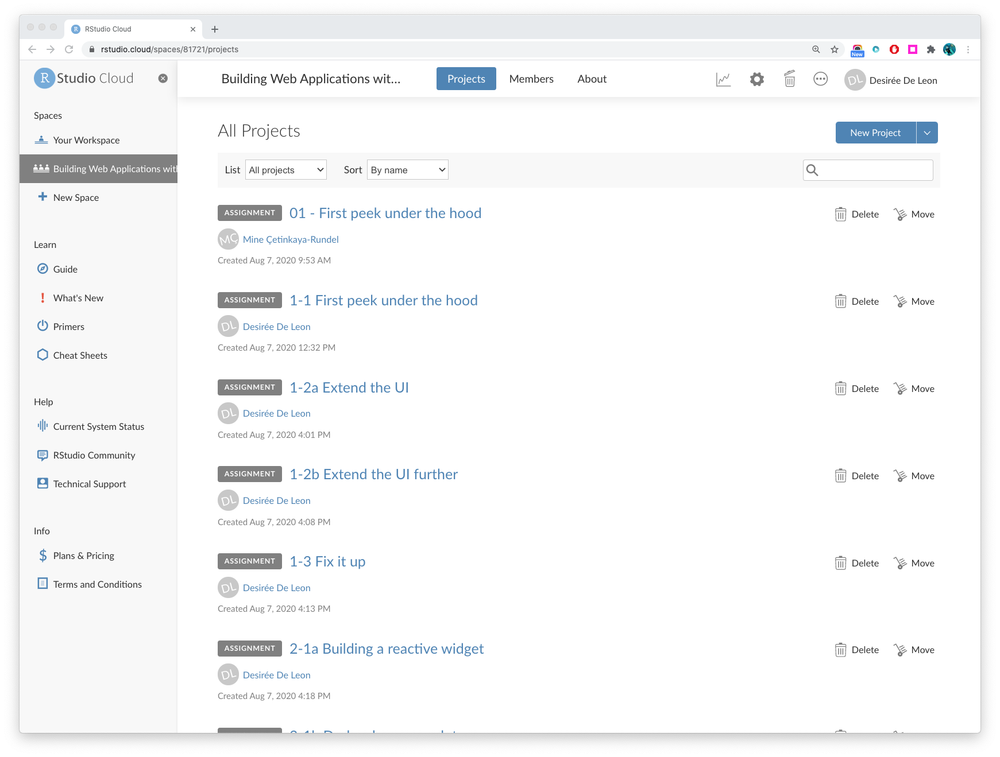
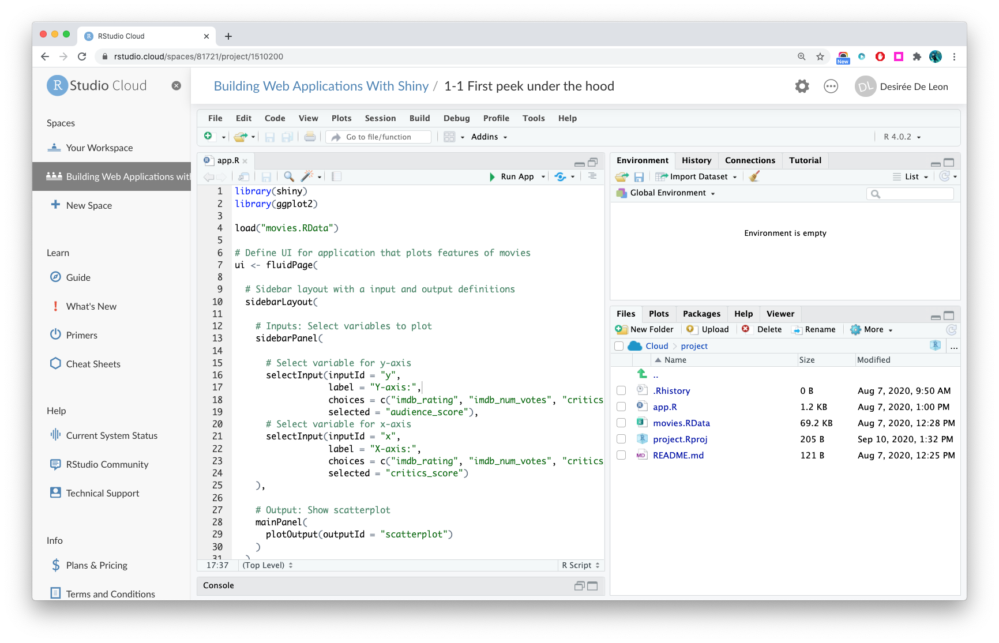

```{r setup, include = FALSE}
knitr::opts_chunk$set(
  echo = FALSE, 
  fig.align = "center",
  out.width = "80%"
  )
```

### Bienvenid@!

El curso está organizado en cuatro módulos:

- Módulo 1: ¡Shiny! - Arquitectura de una aplicación Shiny
- Módulo 2: Flujo reactivo - Entradas para renderizar funciones en Outputs (Salidas)
- Módulo 3: Aspectos básicos de la reactividad - Profundización en el programa reactivo
- Módulo 4: Personalización de la interfaz de usuario: comprensión de cómo crear una interfaz de usuario

### Practicando

Este curso contiene ejercicios de práctica en los que tendrá la oportunidad de crear y modificar una aplicación Shiny usted mismo.

Cuando encuentre un ejercicio en los módulos, verá un botón que se parece a esto:

:::proj

*Navegue hasta el proyecto llamado __1-3 Fix it up__ después de hacer clic en el botón de abajo*

[<i class="fa fa-cloud"></i> Ir a RStudio Cloud Workspace](https://rstudio.cloud/spaces/81721/join?access_code=I4VJaNsKfTqR3Td9hLP7E1nz8%2FtMg6Xbw9Bgqumv){.btn .test-drive}


:::

Este botón se vinculará a un espacio de trabajo en la nube de RStudio para este curso, donde he configurado un proyecto para cada uno de los ejercicios. ¡Cada uno de los proyectos contiene código para que juegues, modifiques y ejecutes!

```{r fig.cap = "The course workspace"}

```

```{r fig.cap = "A project with the code necessary for one of the practice questions"}

```

El último proyecto en este espacio de trabajo contiene scripts Shiny con las soluciones en caso de que te quedes atascado.

### Ejecutando la aplicación localmente

Si no desea trabajar en proyectos de RStudio Cloud, puede optar por ejecutar el código localmente en su propio IDE de RStudio. Para seguir esta ruta, asegúrese de:

1. Descargue el archivo que contiene el conjunto de datos con el enlace a continuación y guárdelo en el Proyecto RStudio en el que estará trabajando. Usaremos este archivo a lo largo del curso.

    ```{r include = TRUE}

    # install and load these packages
    # devtools::install_github('yihui/xfun')

    # embed_file() requires a few more packages
    xfun::pkg_load2(c('base64enc', 'htmltools', 'mime'))
    ```

    ```{r include = TRUE}
    # a embed single file
    xfun::embed_file(path = "movies.RData", text = paste("Download movies.RData") )        
    ```


2. Copie y pegue el código de cada ejercicio, que encontrará al final de cada pregunta del ejercicio. 

### Listo, vamos!

¡Es hora de empezar con este curso de Shiny!

### Preguntas?

[RStudio Community](https://community.rstudio.com/c/shiny/8) es un buen lugar para hacer cualquier pregunta relacionada con Shiny.


